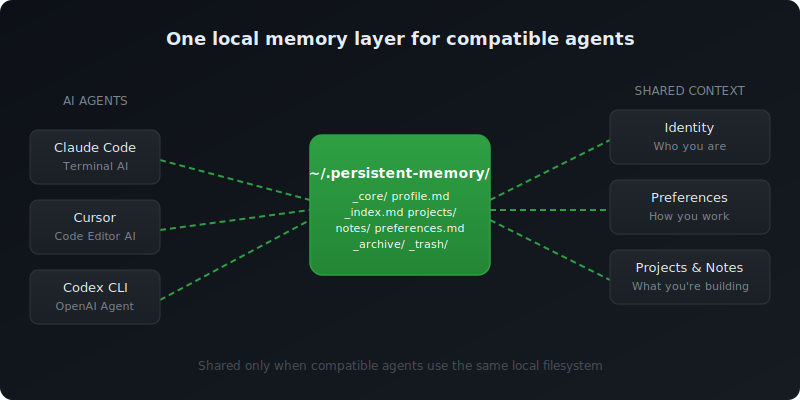

# persistent-memory

**一份记忆，所有 AI agent 共享。一句顶一万句。**



Claude 不知道你跟 Cursor 说了什么。Codex 不知道 Antigravity 存了什么。换个工具，又要从头自我介绍。

装上这个 skill，所有 agent 读同一份记忆。说一句「加载记忆」，不用粘贴，不用重复。

## 效果演示

```
你：  加载记忆

AI：  上下文已加载。你是某创业公司的产品设计师，
      目前在做 v2 改版。你偏好直接的反馈，
      喜欢先想清楚再动手写代码。
      我还有 3 个项目的笔记和你的设计原则。

你：  我们继续上周讨论的新手引导流程。

AI：  [按需读取相关项目文件]
      好的 -- 上次我们把方案缩小到两个方向...
```

**就是这个体验。** 一句话，AI 接上之前的语境 -- 不管你用的是哪个 agent。

## 为什么不用每个 agent 自带的记忆？

现在每个 agent 都有某种记忆功能。问题不是它们记不住 -- 而是**各记各的**。Claude 不知道你跟 Cursor 说了什么，Codex 不知道 Antigravity 存了什么。换个工具就从零开始。

这个 skill 用一份本地共享记忆替代所有平台的内置记忆。你控制存什么，你能看到和编辑每个文件，所有支持 skills 协议的 agent 都能用。

## 快速开始

1. 安装 skill
2. 开始对话，聊到关于你自己的信息
3. AI 会问：*"要不要把这个存到记忆里？"*
4. 同意 -- 搞定。记忆系统已建好。

下次新对话，说一句 **"加载记忆"**，AI 就认识你了。

## 功能

- **即时加载上下文** -- 说"加载记忆"，AI 立刻接上之前的语境
- **智能保存建议** -- AI 识别值得记住的内容，你决定存不存
- **双层架构** -- 核心信息（你是谁、怎么工作）每次都加载；项目细节按需加载
- **你说了算** -- 所有保存都经过你的确认，不会偷偷自动记录

## 工作原理

```
~/.persistent-memory/
├── _core/             # 始终加载（身份、偏好）
├── _index.md          # 轻量索引
├── projects/          # 按需加载
└── notes/             # 按需加载
```

**核心文件**每次对话都加载 -- AI 始终了解你的基本情况。
**其他文件**以一行摘要索引，聊到相关话题时才读取完整内容。记忆增长时也不会占用太多 token。

## 指令

| 你说 | 发生什么 |
|------|---------|
| "加载记忆" / "load memory" | 加载你的完整上下文 |
| "记住这个" / "save this" | 保存信息到记忆（经你确认） |
| "更新记忆" / "update memory" | AI 扫描对话，建议保存什么 |
| "记忆状态" / "memory status" | 显示所有已保存文件及摘要 |

## 自定义结构

默认目录（`projects/`、`notes/`）只是起点，你可以：
- **改名** -- 把目录改成符合你工作流的名字（如 `clients/`、`courses/`）
- **新增** -- 随时加新目录，会被自动索引
- **重组** -- 调整 `_core/` 里的文件，放你每次对话都需要的信息

唯一固定的是 `_core/`（始终加载）和 `_index.md`（自动维护）。其余结构由你决定。

## 使用技巧

- **最佳保存时机**：对话结尾 -- 一次性更新，不打断聊天节奏
- **保持核心精简**：只把每次对话都需要的信息放进 `_core/`，其他放 `projects/` 或 `notes/`
- **支持中英文**：触发词中英文都能用

## 和 CLAUDE.md 是什么关系？

CLAUDE.md 告诉 AI 怎么做你的**项目**（代码风格、技术栈、规范）。这个 skill 告诉 AI **你是谁**（身份、偏好、目标、知识）。一个管项目，一个管人。它们是互补的，不是替代关系。

## 兜底方案（可选）

Skill 不一定每次对话都会被激活。为了保证记忆一定能加载，把这行加到你的 CLAUDE.md 里：

> When I say "load memory", read files from ~/.persistent-memory/_core/ and ~/.persistent-memory/_index.md

这样即使 skill 没触发，记忆也能用。

## 兼容性

支持任何兼容 skills 协议的 AI agent，已验证：
- **Claude Code**（Anthropic）
- **Codex CLI**（OpenAI）
- **Antigravity**（Google）
- [skills.sh](https://skills.sh) 上的其他 agent

记忆存储为本地文件，同一台机器上的所有 agent 自动共享。

## 隐私

所有记忆存储为本地 markdown 文件，不会发送到外部服务器。请勿存储密码或 API 密钥 -- 记忆文件是明文。

## 许可

MIT
